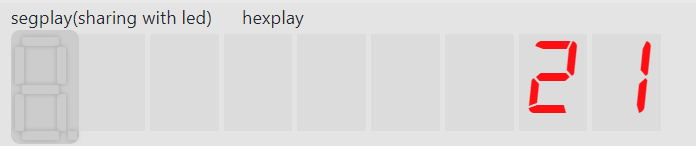
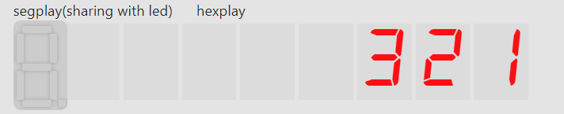
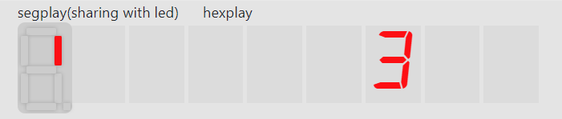

# Lab02: Queue

## Fundamental

* 队列（queue）  
  队列是指这样一种数据结构：
  1. 它是由若干元素组成的有序序列，序列的一端成为队头，另一端称为队尾。
  2. 入队(enqueue)操作指将一新的元素从队尾那一端插入，从而队列中元素的个数加1；
  3. 出队(dequeue)指将队头的1个元素从队列中移除，队列中元素的个数减1。

* 队列在数组中的实现：循环队列  
  在一个数组中实现队列数据结构时，如果我们简单地把数组第1位设定为队头，然后依次存储队列中剩下元素，那么每次出队操作时我们都需把后面的元素向前平移1位，非常麻烦。

  为解决这一问题，我们在脑海里把数组首尾相连，形成一个环，队列元素在这个环中连续放置。设定`head`, `tail`两个指针指向队头与队尾的位置（在实际的实现中，一般指向队尾元素后1个位置，这一点后面再说）。  
  这样，每当出队时，只需将`head`指针在圆环中后移一位，对应到数组上的操作就是$head = head + 1(\text{mod}\ len )$, 其中$len$是数组的长度。

## Target

这次实验要求使用Verilog在一个长度为8的数组中实现队列。

*具体要求看ppt吧，可能需要说明的就是那8个数码管是用来显示目前数组中8个位置所存放的值*

大致效果如下（**最左边那个奇怪的数码管不需要管**）：

`enqueue 1`


`enqueue 2`


`enqueue 3`


`dequeue`


`dequeue`


## Code

*Prerequisite: 第一步register file就不说了，ppt上代码复制一下就能跑*

下面开始看代码了！

* 接口
  和ppt上说的一样
  ```verilog
  module queue(
      input clk,
      input rst,
      input[3:0] in, // 入队操作会把这个数据加入队列
      input enq,
      input deq,
      output reg[3:0] out,// 显示出队数据
      output full,
      output emp,
      // 下面这两个用于数码管显示
      output reg [3:0] seg,
      output reg [2:0] an
      );
  ```

* 一些准备工作
  1. 对出队、入队、重置键取时钟边沿，这样原来的`rst` `enq` `deq`就不用管了
     ```verilog
     wire rstEdge, enqEdge, deqEdge;
     signal_edge se0(clk, rst, rstEdge);
     signal_edge se1(clk, enq, enqEdge);
     signal_edge se2(clk, deq, deqEdge);
     ```
  2. 实例化register file，也就是数组
     ```verilog
     reg  [2:0] ra;
     wire [3:0] rd;
     reg  [2:0] wa;
     reg  [3:0] wd;
     reg we;

     // 下面2个用于数码管显示
     reg  [2:0] hexra;
     wire [3:0] hexrd;

     // register file具有两组读数据端口，其中一个
     // 用于出队时读取出队数据，另一个用于给数码管
     // 显示数据
     register_file rf(.clk(clk), .ra0(ra), .rd0(rd), .ra1(hexra), .rd1(hexrd), .wa(wa), .we(we), .wd(wd));
     ```
  3. `valid`数组
     ppt中提到`valid`数组是用于标记寄存器堆中有效数据的，例如，当队列空时`valid == 8'b0`; 当队列入队3次出队1次后，`valid == 8'b0000_0110`。
     有了这个数组后，我们能很容易地确定`full`和`emp`:
     ```verilog
     assign full = (valid == 8'hFF);
     assign emp  = (valid == 8'h0);
     ```
     并且，当我们出队时只需要改变`head`的值，而不需要在寄存器堆中将出队元素清零。  

  4. `head` & `tail`
     这里解释为什么`tail`一般指向队尾元素的后一位。原因是若`tail`指向队尾元素，则无法表示空队列情形。而若`tail`指向队尾的后一位，则空队列时`head == tail`.  
  5. 一些初始化
     也就是将一些`reg`清零，免得出现些莫名其妙的错
     ```verilog
     initial begin
        valid <= 8'b0;
        head <= 3'b0;
        tail <= 3'b0;
        out <= 4'b0;

        // 下面这两个值还没有解释，下文中会说到
        afterDeqFlag <= 0;
        afterWeFlag <= 0;
     end
     ```

* Operations -- 出队，入队，清零
  这些操作都在一个`always` block 中实现。
  1. Enqueue
     1. 将`in`写入`tail`指向的位置（注意`tail`不指向队列中元素）
        1. 向写地址`wa`写入`tail`
        2. 向写数据`wd`写入`in`
        3. 将写使能`we`置1
        4. 在一个时钟周期后清零`we`
           通过在下个周期判断`we`的值来决定是否清零
     2. `tail`自增1
     3. 维护`valid`
     ```verilog
     always @(posedge clk) begin
         if(we)begin
             we <= 0;
         end
         ...
         if(enqEdge && !full)begin
             tail <= tail + 1;
             we <= 1;
             wa <= tail;
             wd <= in;
             valid[tail] <= 1'b1;
             out <= 4'b0;
         end
         ...
     end
     ```
  2. Dequeue
     这一块我有部分解释不了，也是无奈才这样处理，等我问问别人吧
     ```verilog
     always @(posedge clk) begin
         ...
         if(afterDeqFlag) begin
             afterDeqFlag <= 0;
             out <= rd;
         end
         ...
         else if(deqEdge && !emp)begin
             head <= head + 1;
             ra <= head;
             afterDeqFlag <= 1;
             valid[head] <= 1'b0;
         end
         ...
     end
     ```
  3. Reset
     ```verilog
     always @(posedge clk) begin
         ...
         else if(rstEdge)begin
                 head <= 3'b0;
                 tail <= 3'b0;
                 valid <= 8'b0;
                 ra <= 3'b0;
                 out <= 4'b0;
         end
     end
     ```

* Display
  *Prerequisite: [hexplay doc](https://git.ustc.edu.cn/hexuustc/fpgaol-examples#user-content-七段数码管:~:text=%E6%95%B0%E7%A0%81%E7%AE%A1%E5%88%86%E4%B8%BAhex_play%E5%92%8Cseg_play%E4%B8%A4%E9%83%A8%E5%88%86%EF%BC%8C%E5%AE%9E%E9%AA%8C%E6%97%B6%E6%88%91%E4%BB%AC%E4%B8%BB%E8%A6%81%E7%94%A8%E5%88%B0%E7%9A%84%E6%98%AFhex_play%E3%80%82-,hex_play,%20%20display%20%60max_j%60%20on%20%60i%60,-seg_play)*
  ```verilog
  reg [4:0] hexplay_cnt;// For hex_play refreshing.  
  always@(posedge clk) begin
      hexplay_cnt <= hexplay_cnt + 1;
  end
  always @(posedge clk) begin
      
      // 这一部分需要特别说明
      // 为使数组中无数据部分对应的数码管不显示，an应
      // 只在满足valid[an]=1的集合中跳转，所以当an自增1会达到无数据位时（即tail的位置），
      // 将其置为队头位置
      if(hexplay_cnt == 0)begin
          if(!valid[an + 1])
              an <= head;
          else begin
              an <= an + 1;
          end
      end
  end
  
  always @(*) begin
      if(valid[an])begin
          hexra = an;
          seg = hexrd;
      end
      else
          seg = 4'b0;
  end
  ```

## Conclusion

没啥总结的，有地方没说清楚再问，deque那部分要是后面找不到更好的处理再说吧。