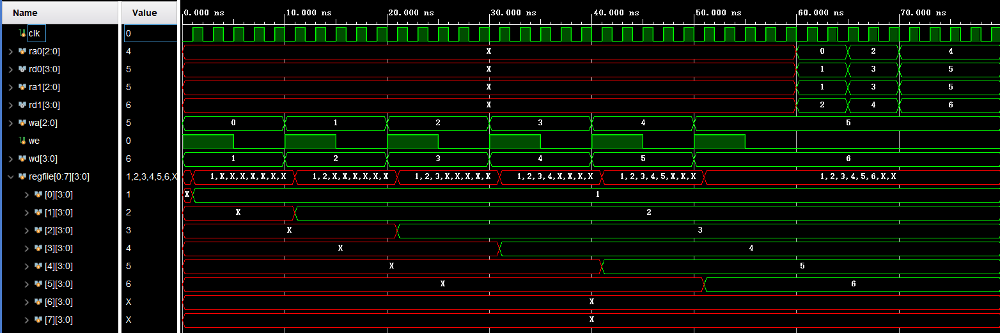
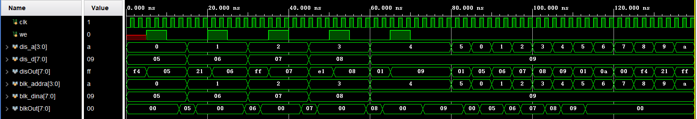
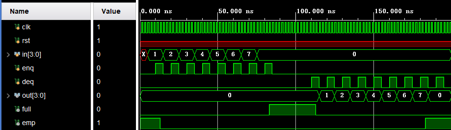
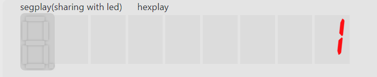
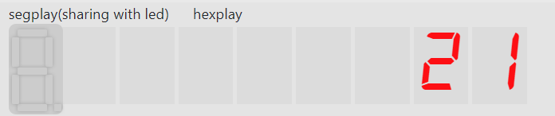
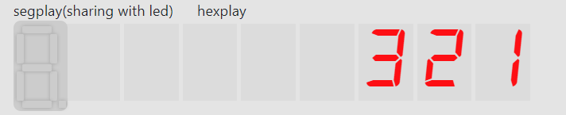
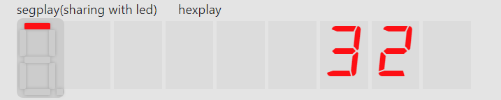

# Report: Lab02 寄存器堆与存储器及其应用  

袁玉润 PB19111692

## Register File

* Code

    ```verilog
    module register_file
    #(parameter WIDTH = 4)
    (
    input clk,
    input [2:0] ra0,
    output [WIDTH-1:0] rd0,
    input [2:0] ra1,
    output [WIDTH-1:0] rd1,
    input [2:0] wa,
    input we,
    input [WIDTH-1:0] wd
        );
        reg[WIDTH-1:0] regfile[0:7];
        assign rd0 = regfile[ra0];
        assign rd1 = regfile[ra1];
        always @(posedge clk) begin
            if(we)
                regfile[wa] <= wd;
        end
    endmodule
    ```

* Simulation

  前60ns内向寄存器堆依次写入6个数，之后读取其中3个  
  ```verilog
  module regfile_testbench();
      reg clk;
      reg [2:0] ra0;
      wire [3:0] rd0;
      reg [2:0] ra1;
      wire [3:0] rd1;
      reg [2:0] wa;
      reg we;
      reg [3:0] wd;

      register_file rf(clk, ra0, rd0, ra1, rd1, wa, we, wd);

      initial clk = 0;
      always #1 clk=~clk;

      initial begin
          wa = 3'd0; wd = 4'd1; we = 1; 
          #5 we = 0;
      #5  wa = 3'd1; wd = 4'd2; we = 1; 
          #5 we = 0;
      #5  wa = 3'd2; wd = 4'd3; we = 1; 
          #5 we = 0;
      #5  wa = 3'd3; wd = 4'd4; we = 1; 
          #5 we = 0;
      #5  wa = 3'd4; wd = 4'd5; we = 1; 
          #5 we = 0;
      #5  wa = 3'd5; wd = 4'd6; we = 1; 
          #5 we = 0;
      #5  ra0 = 3'd0; ra1 = 3'd1;
      #5  ra0 = 3'd2; ra1 = 3'd3;
      #5  ra0 = 3'd4; ra1 = 3'd5;
      $finish;
      end
  endmodule
  ```

  

## IP核

`mem_testbench.v`

```verilog
module mem_testbench();
    reg clk;
    reg we;

    reg [3:0] dis_a;
    reg [7:0] dis_d;
    wire [7:0] disOut;

    reg [3:0] blk_addra;
    reg [7:0] blk_dina;
    wire [7:0]blkOut;

    dist_mem_gen_0 dmg(.a(dis_a), .d(dis_d), .clk(clk), .we(we), .spo(disOut));

    blk_mem_gen_0 bmg(.addra(blk_addra), .clka(clk), .dina(blk_dina), .douta(blkOut), .ena(1), .wea(we));

    initial clk = 0;
    always #1 clk=~clk;

    initial begin
        dis_a = 4'd0; blk_addra = 4'd0; dis_d = 4'd5; blk_dina = 4'd5; #5 we = 1; #5 we = 0;

    #5  dis_a = 4'd1; blk_addra = 4'd1; dis_d = 4'd6; blk_dina = 4'd6; #5 we = 1; #5 we = 0;

    #5  dis_a = 4'd2; blk_addra = 4'd2; dis_d = 4'd7; blk_dina = 4'd7; #5 we = 1; #5 we = 0;

    #5  dis_a = 4'd3; blk_addra = 4'd3; dis_d = 4'd8; blk_dina = 4'd8; #5 we = 1; #5 we = 0;

    #5  dis_a = 4'd4; blk_addra = 4'd4; dis_d = 4'd9; blk_dina = 4'd9; #5 we = 1; #5 we = 0;


    #10 dis_a = 4'd5;  blk_addra = 4'd5; 
    #5  dis_a = 4'd0;  blk_addra = 4'd0;
    #5  dis_a = 4'd1;  blk_addra = 4'd1;
    #5  dis_a = 4'd2;  blk_addra = 4'd2;
    #5  dis_a = 4'd3;  blk_addra = 4'd3;
    #5  dis_a = 4'd4;  blk_addra = 4'd4;
    #5  dis_a = 4'd5;  blk_addra = 4'd5;
    #5  dis_a = 4'd6;  blk_addra = 4'd6;
    #5  dis_a = 4'd7;  blk_addra = 4'd7;
    #5  dis_a = 4'd8;  blk_addra = 4'd8;
    #5  dis_a = 4'd9;  blk_addra = 4'd9;
    #5  dis_a = 4'd10; blk_addra = 4'd10;
    #5  $finish;
    end
endmodule
```



区别：

分布式存储器为read first mode，写入数据时输出端立即出现新写入数据。

块式存储器为write first mode，写入数据后输出端显示写入前的数据。

## Queue

* 接口
  ```verilog
  module queue(
      input clk,
      input rst,
      input[3:0] in,
      input enq,
      input deq,
      output reg[3:0] out,
      output full,
      output emp,
      // 用于数码管显示
      output [3:0] seg,
      output [2:0] an
      );
  ```

* 一些准备工作
  1. 对出队、入队、重置键取时钟边沿
     ```verilog
     wire rstEdge, enqEdge, deqEdge;
     signal_edge se0(clk, rst, rstEdge);
     signal_edge se1(clk, enq, enqEdge);
     signal_edge se2(clk, deq, deqEdge);
     ```
  2. 实例化register file
     ```verilog
     reg  [2:0] ra;
     wire [3:0] rd;
     reg  [2:0] wa;
     reg  [3:0] wd;
     reg we;

     // 用于数码管显示
     wire  [2:0] hexra;
     wire [3:0] hexrd;

     // register file具有两组读数据端口，其中一个
     // 用于出队时读取出队数据，另一个用于给数码管
     // 显示数据
     register_file rf(.clk(clk), .ra0(ra), .rd0(rd), .ra1(hexra), .rd1(hexrd), .wa(wa), .we(we), .wd(wd));
     ```
  3. `valid`数组
     `valid`数组是用于标记寄存器堆中有效数据. 
     有了这个数组后，我们能很容易地确定`full`和`emp`:
     ```verilog
     assign full = (valid == 8'hFF);
     assign emp  = (valid == 8'h0);
     ```

  4. `head` & `tail`
  5. Initialization
     ```verilog
     initial begin
        valid <= 8'b0;
        head <= 3'b0;
        tail <= 3'b0;
        out <= 4'b0;

        afterDeqFlag <= 0;
     end
     ```

* Operations -- 出队，入队，清零
  这些操作都在一个`always` block 中实现。
  1. Enqueue
     1. 将`in`写入`tail`指向的位置（注意`tail`不指向队列中元素）
        1. 向写地址`wa`写入`tail`
        2. 向写数据`wd`写入`in`
        3. 将写使能`we`置1
        4. 在一个时钟周期后清零`we`
           通过在下个周期判断`we`的值来决定是否清零
     2. `tail`自增1
     3. 维护`valid`
     ```verilog
     always @(posedge clk) begin
         if(we)begin
             we <= 0;
         end
         ...
         if(enqEdge && !full)begin
             tail <= tail + 1;
             we <= 1;
             wa <= tail;
             wd <= in;
             valid[tail] <= 1'b1;
             out <= 4'b0;
         end
         ...
     end
     ```
  2. Dequeue
     本周期内将读地址写入`ra`，下个周期内将`rd`写入`out`(使用LED灯显示出队数据)

     ```verilog
     always @(posedge clk) begin
         ...
         if(afterDeqFlag) begin
             afterDeqFlag <= 0;
             out <= rd;
         end
         ...
         else if(deqEdge && !emp)begin
             head <= head + 1;
             ra <= head;
             afterDeqFlag <= 1;
             valid[head] <= 1'b0;
         end
         ...
     end
     ```

  3. Reset
     ```verilog
     always @(posedge clk) begin
         ...
         else if(rstEdge)begin
                 head <= 3'b0;
                 tail <= 3'b0;
                 valid <= 8'b0;
                 ra <= 3'b0;
                 out <= 4'b0;
         end
     end
     ```

* Display
  
  将显示功能单独分离到`SDU`模块
  
  ```verilog
  module SDU(
      input clk,
      input[7:0] valid,
      output reg [2:0] hexra,
      input [3:0] hexrd,
      input [2:0] head,
      output reg [3:0] seg,
      output reg [2:0] an
      );
      reg [4:0] hexplay_cnt;// For hex_play refreshing.  
      always@(posedge clk) begin
  		hexplay_cnt <= hexplay_cnt + 1;
      end
  
      always @(posedge clk) begin
          // 为使数组中无数据部分对应的数码管不显示，an
          // 只在满足valid[an]=1的集合中跳转。当an自增1
          // 达到无数据位时（即tail的位置），
          // 将其置为队头位置  
          if(hexplay_cnt == 0)begin
              if(!valid[an + 1])
                  an <= head;
              else begin
                  an <= an + 1;
              end
          end
      end
      
      always @(*) begin
          if(valid[an])begin
              hexra = an;
              seg = hexrd;
          end
          else
              seg = 4'b0;
      end
  endmodule
  ```
  
  在主模块中实例化
  
  ```verilog
  SDU sdu(.clk(clk), .valid(valid), .hexra(hexra), .hexrd(hexrd), .head(head), .seg(seg), .an(an));
  ```
  
  
  
* Simulation
  
  ```verilog
  module queue_testbench();
      reg clk;
      reg rst;
      reg[3:0] in;
      reg enq;
      reg deq;
      wire[3:0] out;
      wire full;
      wire emp;
      wire [3:0] seg;
    wire [2:0] an;
  
    queue q(.clk(clk), .rst(rst), .in(in), .enq(enq), .deq(deq), .out(out), .full(full), .emp(emp), .seg(seg), .an(an));
  
      initial clk = 0;
    always #1 clk=~clk;
  
      initial begin
          enq = 0; deq = 0; #5
          in = 3'd1; #5 enq = 1; #5 enq = 0;
          in = 3'd2; #5 enq = 1; #5 enq = 0;
          in = 3'd3; #5 enq = 1; #5 enq = 0;
          in = 3'd4; #5 enq = 1; #5 enq = 0;
          in = 3'd5; #5 enq = 1; #5 enq = 0;
          in = 3'd6; #5 enq = 1; #5 enq = 0;
          in = 3'd7; #5 enq = 1; #5 enq = 0;
          in = 3'd8; #5 enq = 1; #5 enq = 0;
  #20
  #5      deq = 1; #5 deq = 0;
  #5      deq = 1; #5 deq = 0;
  #5      deq = 1; #5 deq = 0;
  #5      deq = 1; #5 deq = 0;
  #5      deq = 1; #5 deq = 0;
  #5      deq = 1; #5 deq = 0;
  #5      deq = 1; #5 deq = 0;
  #5      deq = 1; #5 deq = 0;
  #5      deq = 1; #5 deq = 0;
  #5      rst = 1;
  $finish;
      end
  endmodule
  ```



* Run on FPGAOL

`enqueue 1`


`enqueue 2`


`enqueue 3`


`dequeue`


`dequeue`
