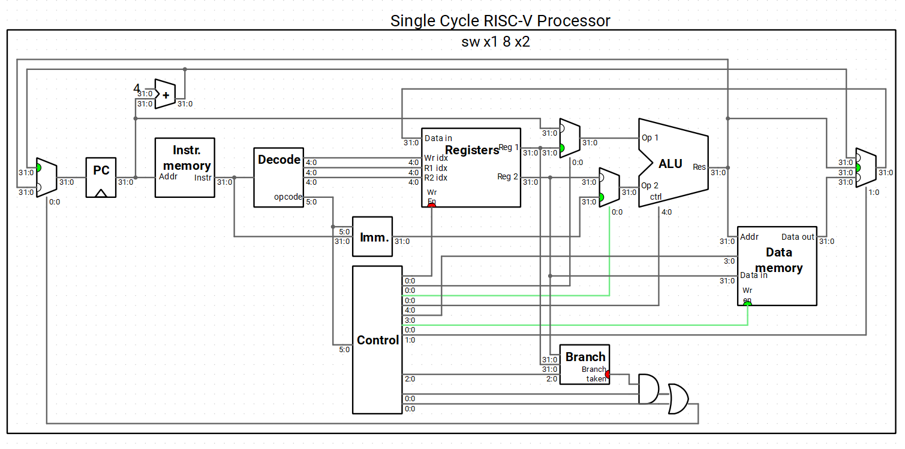
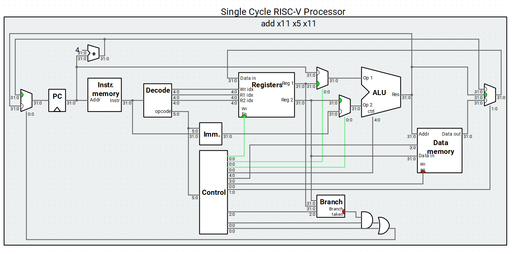
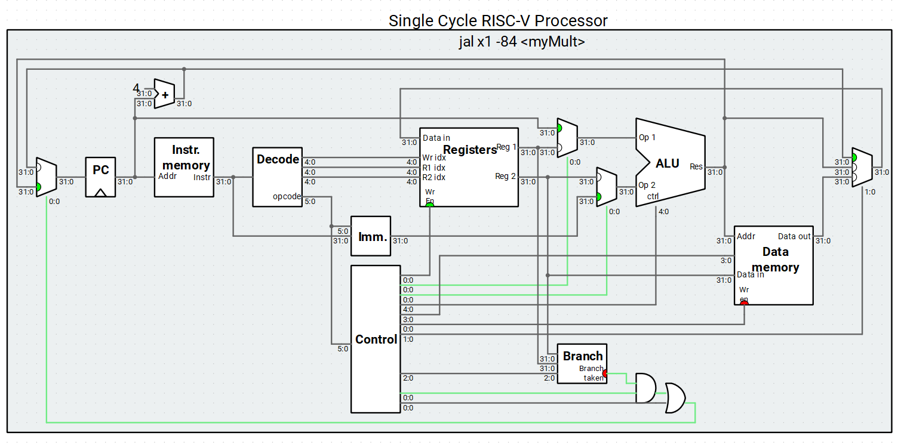
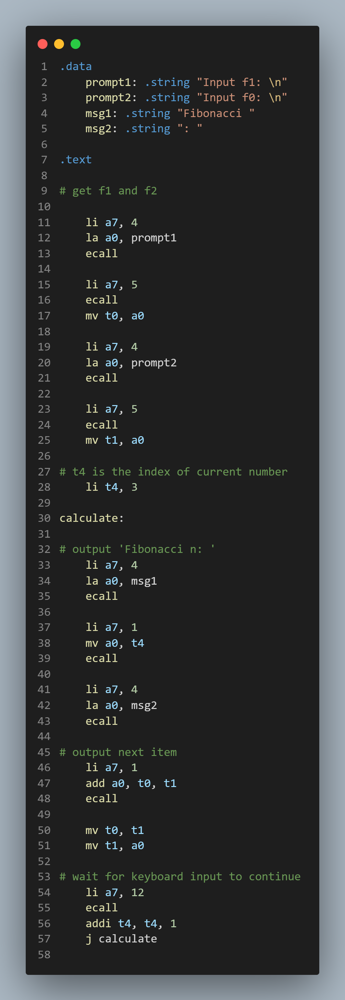
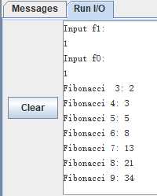

# Lab03 CPU测试及汇编程序设计

## 基础`RISC-V`指令执行过程

* `sw`

  `sw rs2, imm(rs1)`

  * `rs1`: 寄存器堆的`Reg1`端口

    `imm`: 将指令中立即数signed extend为32bit

    二者由ALU计算作为Data Memory的地址。

  * `rs2`: 寄存器堆的`Reg2` 端口，通往Data Memory的Data in。

  

* `lw`

  `lw rd, imm(rs1)`

  * `rd`: 寄存器堆的Wr idx指定的目标寄存器。由Data Memory的Data out端口经mux后向`rd`赋值
  * 由ALU计算`imm + rs1`获得数据内存的读地址

  

* `add`

  `add rd, rs1, rs2`

  `rs1`, `rs2`分别由register的`Reg1`, `Reg2`提供，由ALU计算后结果经mux存入Register`rd`位置

  

* `addi`

  `addi rd, rs1, imm`

  * `rs1`: 寄存器堆的`Reg1`端口

  * `imm`: 将指令中立即数signed extend为32bit
  * `rd`: ALU计算结果经mux后存入register中`rd`

* `beq`

  `beq rs1, rs2, imm`

  * `PC + Offset`的值由ALU计算
  * `rs1`,`rs2`的比较由Branch Unit进行
  * `PCSrc = (Branch Taken && Branch)|| Jal`

  

* `jal`

  `jal imm`

  * `PC + Offset`的值由ALU计算
  * ALU 计算结果经mux后存入Register中`x0`

  

  ## Fibonacci

  

  

