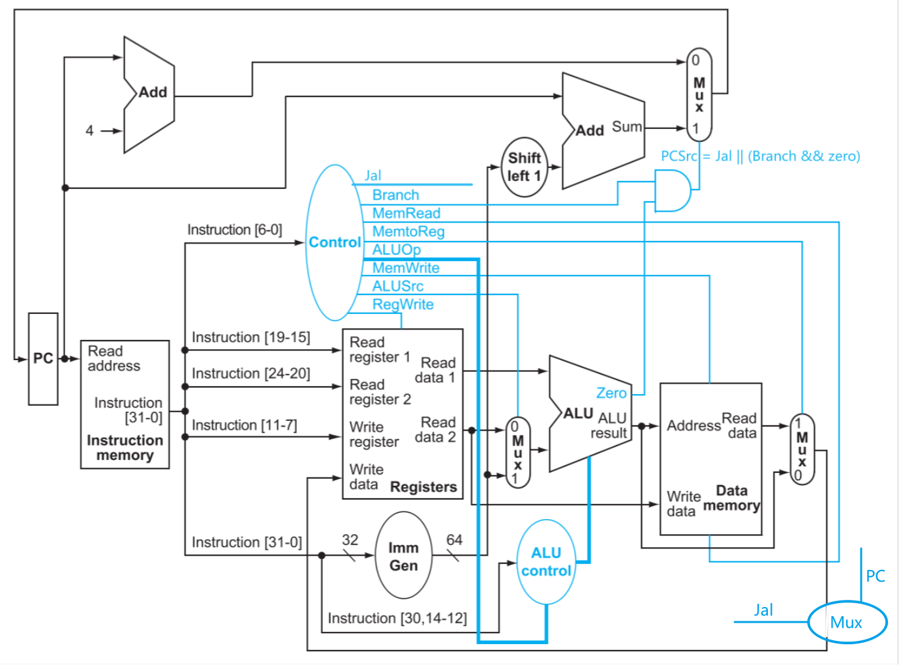
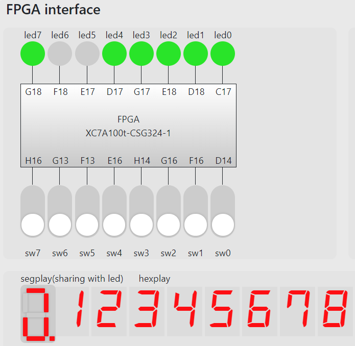
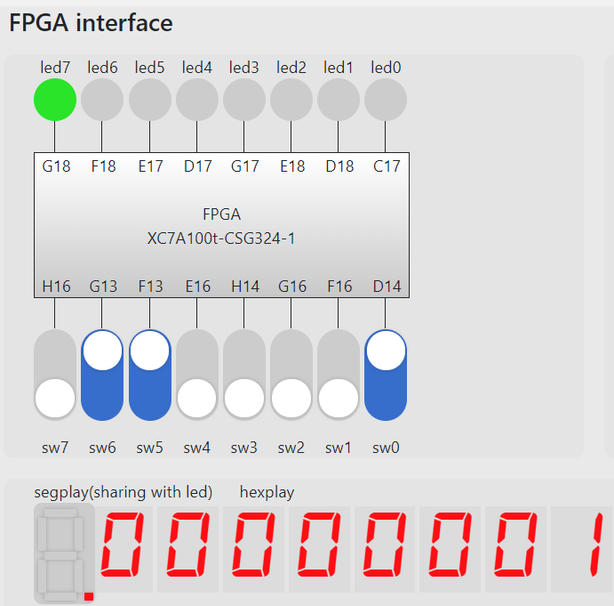
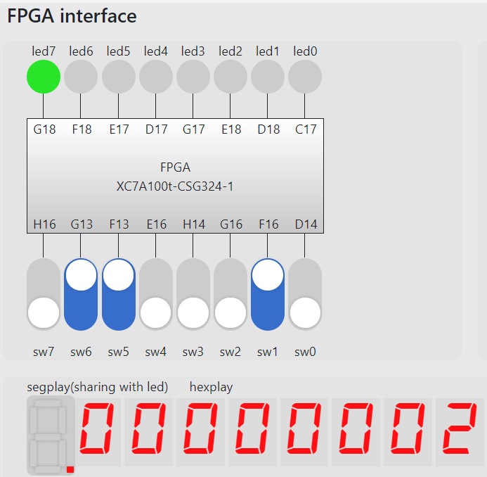
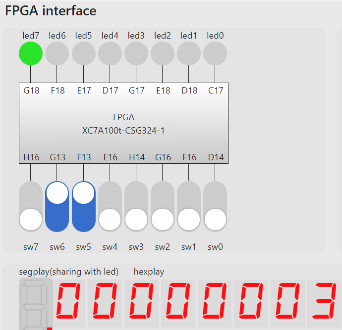
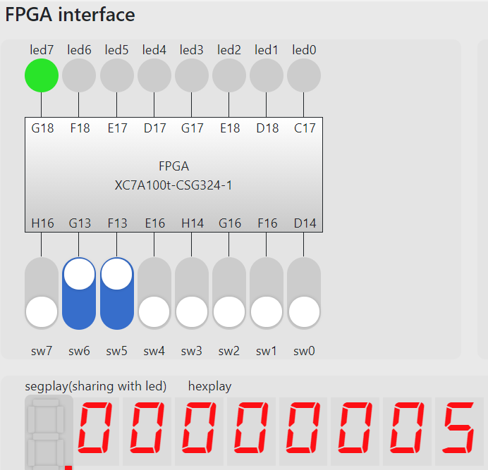
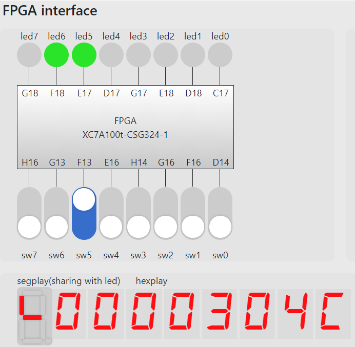
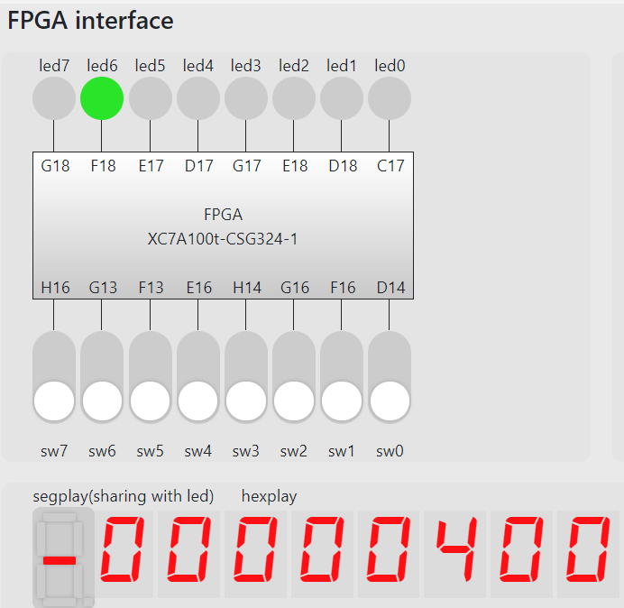
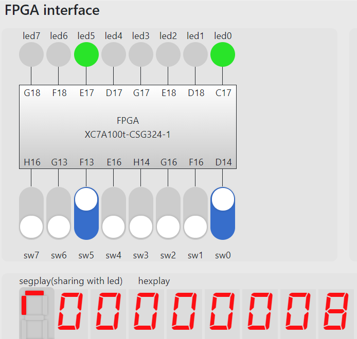

# Report on Lab04: Single Cycle CPU

## Objective

实现支持`add`, `addi`, `lw`, `sw`, `beq`, `jal`六条指令的基于`risc-v`指令集架构的单周期CPU，配合PDU模块在FPGAOL上运行`fibonacci.s`。

## Structure

项目结构如下

* integration

  用于将CPU和PDU连接，并将FPGAOL平台上的LED灯和switch等传递至PDU。

  * CPU(Control)

    * ALU

    * register file

    * instruction memory

    * data memory manager

      用于处理内存地址与外设的映射

      * data memory

    * immediate generator

  * PDU

    使用已提供的PDU模块

实现结构与下图中数据通路一致（注意图中针对`jal`指令所作的改动）



## Implementation

下面介绍CPU各模块的实现

* ALU

  一个带有`zero`位的纯组合逻辑ALU

* register file

  32*32bit 同步写，异步读

  * 输出端口

    `read_addr0`, `read_data0`;

    `read_addr1`, `read_data1`;

    `debug_read_addr`， `debug_read_data`

  * 输入端口

    `write_addr`, `write_data`

* instruction memory

  256*32bit 分布式存储器。

  使用`fibonacci.coe`初始化

* data memory manager

  将data memory包装，处理地址对应外设时的情形

  ```verilog
  data_mem dm(.clk(clk), .a(mem_a), .d(d), .we(we), .spo(mem_rd),
  .dpra(debug_addr), .dpo(debug_data));
  ```

  ```verilog
  // Write
  if(we) begin
      if(a[8])begin // device
          io_addr <= {a[5:0],2'b0};
          io_dout <= d;
          io_we   <= 1;
      end
      else begin // memory
          io_we <= 0;
          mem_a <= a[7:0];
      end
  end
  ```

  ```verilog
  // Read
  if(a[8])begin // device
      io_addr <= {a[7:0], 2'b0};
      spo <= io_din;
  end
  else begin //memory
      mem_a <= a[7:0];
      spo <= mem_rd;
  end
  ```

* Immediate Generator

  ```verilog
  always @(*) begin
      case (instr[6:0])
      addi_op: imm <= {{20{instr[31]}},instr[31:20]};
      lw_op  : imm <= {{20{instr[31]}},instr[31:20]};
      sw_op  : imm <= {{20{instr[31]}},instr[31:25],instr[11:7]};
      beq_op : imm <= {{20{instr[31]}}, instr[31], instr[7], instr[30:25], instr[11:8]};
      jal_op : imm <= {{12{instr[31]}}, instr[31],instr[19:12], instr[20], instr[30:21]};
      endcase
  end
  ```

* Control

  在实现以上基础模块后，Control模块负责将各部分实例化、IO间连接、维护`pc`等操作

  1. Control信号

     ```verilog
     always @(*) begin
         case (IR[6:0])
         add_op : signals <= RegWrite;
         addi_op: signals <= ALUSrc   | RegWrite;
         lw_op  : signals <= MemRead  | MemtoReg | ALUSrc | RegWrite;
         sw_op  : signals <= MemWrite | ALUSrc;
         beq_op : signals <= Branch;
         jal_op : signals <= Jal;
         endcase
     end
     ```

  2. 模块实例化

     ```verilog
     instruction_mem im(.a(pc[9:2]), .spo(ir_wire),.clk(clk), .we(0));
     
     data_mem_mmu dmm(.clk(clk), .a(alu_res[10:2]),.d(reg_rd2), .we(signals[4]), .spo(dmem_rd), .io_addr(io_addr), .io_dout(io_dout), .io_we(io_we), .io_din(io_din),
     .debug_addr(m_rf_addr), .debug_data(m_data));
     
     ALU alu(.a(reg_rd1), .b(alu_b), .f(alu_f), .y(alu_res), .z(zero));
     
     registers r(.clk(clk), .ra0(IR[19:15]), .ra1(IR[24:20]), .wa(IR[11:7]), .we(signals[6]), .wd(reg_wd), .rd0(reg_rd1), .rd1(reg_rd2),
     .debug_addr(m_rf_addr), .debug_data(rf_data));
     
     imm_gen ig(.instr(IR), .imm(imm));
     ```

  3. 维护`pc`

     ```verilog
     always @(posedge clk, posedge rst) begin
         if(rst)
             pc <= 32'h3000;
         else begin
             if(PCSrc)
                 pc <= pc + (imm << 1);
             else
                 pc <= pc + 4;
         end
     end
     ```

  4. mux实现

     ```verilog
     // ALU second operand source
     assign alu_b  = signals[5]?  imm  : reg_rd2;
     
     // In case of `jal`, pc might be written into register file
     assign reg_wd = signals[1]?  pc   : (signals[3]? dmem_rd : alu_res);
     
     // ALU op
     assign alu_f  = signals[0]?  3'b1 : 3'b0;
     ```

## Performance

下面展示使用`fibonacci.coe`初始化后生成`integration.bit`在FPGAOL上的运行效果

1. 启动



2. 输入$f_0=1$, $f_1=2$





3. 计算$f_n$






4. 调试模式

   1. 查看`pc`

   

   2. 查看存储器(`x0000_0000`处)

   

   3. 查看寄存器(`x1`)

   