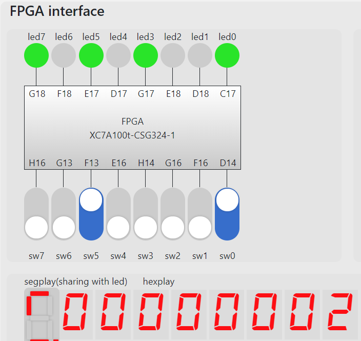

# Report on Lab05: Pipeline CPU

## Objective

实现支持`add`, `addi`, `lw`, `sw`, `beq`, `jal`六条指令的基于`risc-v`指令集架构的5-stage流水线CPU，实现Forwarding, Hazard Detection Unit模块，解决6条指令间控制相关与数据线管。配合PDU模块在FPGAOL上运行`hazard.s`, `fibonacci.s`。

## Structure

项目结构如下

* integration

  用于将CPU和PDU连接，并将FPGAOL平台上的LED灯和switch等传递至PDU。

  * CPU

    * ALU

    * Register File

      **写优先寄存器堆**。（本质上属于Forwarding）

    * Instruction Memory

    * Data Memory Manage

      用于处理内存地址与外设的映射

      * data memory

    * Immediate Generator

    * **Hazard Detection Unit**

    * **Forwarding Unit**

  * PDU

    使用已提供的PDU模块

* Datapath

  

  图中与实际实现的不同之处：

  1. ALU第二个操作数可来自ID/EX段Immediate寄存器，或Forwarding_B所控制多路选择器的输出。图中未标示出此多路选择器。

  2. 在我的实现中，ID/EX, EX/MEM, MEM/WB的段寄存器中含有完整的Control信号，并未删去后期阶段未使用的信号。这样实现便于向PDU模块提供调试信息，同时使代码更加简洁。

  3. `beq`的判断阶段由图示的ID延迟至EX。这样实现是因为，提前跳转判断时机可能引起更复杂的Data Hazard探测逻辑. 如

     ```riscv
     add x1, x2, x3
     beq x0, x1, label
     ```

     会要求在两条指令中stall以避免相关。

     在EX段跳转需要ID/EX段寄存器也具有Flush控制信号。

     用于计算`PC + (Imm << 1)`的加法器也移至EX段。其中`PC`是ID/EX段寄存器中的PC寄存器。

  ## Implementation

  下面介绍CPU各模块的实现

  * ALU

    一个带有`zero`位的纯组合逻辑ALU

  * register file

    32*32bit 同步写，异步读, 写优先。

    写优先的实现：

    ```verilog
    if(ra0 == wa && ra0 != 5'b0)
        rd0 = wd;
    else
        rd0 = regfile[ra0];
    
    if(ra1 == wa && ra1 != 5'b0)
        rd1 = wd;
    else
        rd1 = regfile[ra1];
    ```

  * instruction memory

    256*32bit 分布式存储器。

  * data memory manager

    将data memory包装，处理地址对应外设时的情形

    ```verilog
    data_mem dm(.clk(clk), .a(mem_a), .d(d), .we(we), .spo(mem_rd),
    .dpra(debug_addr), .dpo(debug_data));
    ```

    ```verilog
    // Write
    if(we) begin
        if(a[8])begin // device
            io_addr <= {a[5:0],2'b0};
            io_dout <= d;
            io_we   <= 1;
        end
        else begin // memory
            io_we <= 0;
            mem_a <= a[7:0];
        end
    end
    ```

    ```verilog
    // Read
    if(a[8])begin // device
        io_addr <= {a[7:0], 2'b0};
        spo <= io_din;
    end
    else begin //memory
        mem_a <= a[7:0];
        spo <= mem_rd;
    end
    ```

  * Immediate Generator

    ```verilog
    always @(*) begin
        case (instr[6:0])
        addi_op: imm <= {{20{instr[31]}},instr[31:20]};
        lw_op  : imm <= {{20{instr[31]}},instr[31:20]};
        sw_op  : imm <= {{20{instr[31]}},instr[31:25],instr[11:7]};
        beq_op : imm <= {{20{instr[31]}}, instr[31], instr[7], instr[30:25], instr[11:8]};
        jal_op : imm <= {{12{instr[31]}}, instr[31],instr[19:12], instr[20], instr[30:21]};
        endcase
    end
    ```

  * Forwarding Unit

    ```verilog
    // ForwardingA
    if(EX_M_RegWrite && EX_M_Rd!=0 && EX_M_Rd == ID_EX_Rs1)
        ForwardingA = 2'b10;
    else if(M_WB_RegWrite && M_WB_Rd != 0 && M_WB_Rd == ID_EX_Rs1)
        ForwardingA = 2'b01;
    else
        ForwardingA = 2'b0;
    
    // ForwardingB
    ...
    ```

  * Hazard Detection Unit

    ```verilog
    if(ID_EX_MemRead &&  // Indicates it's `lw`
    (ID_EX_Rd == IF_ID_Rs1 || ID_EX_Rd == IF_ID_Rs2)) begin // There is a hazard
        PCWrite = 0;
        IF_ID_Write = 0;
        ID_EX_Src = 1;
    end
    else begin
        PCWrite = 1;
        IF_ID_Write = 1;
        ID_EX_Src = 0;
    end
    ```

  * CPU_pl

    在实现以上基础模块后，CPU模块负责将各部分实例化、描述各流水段行为、IO间连接、维护`pc`等操作

    1. Control信号

       ```verilog
       always @(*) begin
           case (IF_ID_Instruction[6:0])
           add_op : signals = RegWrite ;
           addi_op: signals = ALUSrc   | RegWrite ;
           lw_op  : signals = MemRead  | MemtoReg | ALUSrc | RegWrite;
           sw_op  : signals = MemWrite | ALUSrc   ;
           beq_op : signals = Branch   ;
           jal_op : signals = Jal      ;
           default: signals = 7'b0     ;
           endcase
       end
       
       assign IF_Flush = PCSrc;
       assign ID_Flush = PCSrc;
       ```

    2. 模块实例化

       ```verilog
       InstructionMem im(
           .a(PC[9:2]), 
           .spo(ir_wire),
           .clk(clk), 
           .we(0)
       );
       Registers r(
           .clk(clk), 
           .ra0(IF_ID_Instruction[19:15]), 
           .ra1(IF_ID_Instruction[24:20]), 
           .wa(M_WB_Rd), 
           .we(SigMEMWB[6]), 
           .wd(reg_wd), 
           .rd0(reg_rd1), 
           .rd1(reg_rd2),
           .debug_addr(m_rf_addr), 
           .debug_data(rf_data)
       );
       ImmGen ig(
           .instr(IF_ID_Instruction), 
           .imm(imm)
       );
       HazardDetectionUnit hdu(
           .ID_EX_MemRead(SigIDEX[2]), 
           .ID_EX_Rd(ID_EX_Rd), 
           .IF_ID_Rs1(IF_ID_Instruction[19:15]), 
           .IF_ID_Rs2(IF_ID_Instruction[24:20]), 
           .PCWrite(PCWrite), 
           .IF_ID_Write(IF_ID_Write), 
           .ID_EX_Src(ID_EX_Src)
       );
       ALU alu(
           .a(ALU_a), 
           .b(ALU_b), 
           .f(ALU_op), 
           .y(ALURes), 
           .z(zero)
       );
       ForwardingUnit fu(
           .ID_EX_Rs1(ID_EX_Rs1), 
           .ID_EX_Rs2(ID_EX_Rs2), 
           .EX_M_Rd(EX_M_Rd), 
           .M_WB_Rd(M_WB_Rd), 
           .EX_M_RegWrite(SigEXMEM[6]), 
           .M_WB_RegWrite(SigMEMWB[6]), 
           .ForwardingA(ForwardingA), 
           .ForwardingB(ForwardingB)
       );
       DataMemManage dmm(
           .clk(clk), 
           .a(EX_M_ALURes[10:2]),
           .d(EX_M_ALU_b), 
           .we(SigEXMEM[4]), 
           .spo(dmem_rd), 
           .io_addr(io_addr), 
           .io_dout(io_dout), 
           .io_we(io_we), 
           .io_din(io_din),
           .debug_addr(m_rf_addr), 
           .debug_data(m_data)
       );
       ```

    3. IF

       ```verilog
       always @(*) begin
           PCSrc  = SigIDEX[1] || (SigIDEX[0] && zero);
       end
       always @(*) begin
           if(PCWrite) begin
               if(PCSrc)
                   next_pc = ID_EX_PC + (ID_EX_Imm << 1);
               else
                   next_pc = PC + 4;
           end
           else
               next_pc = PC;
       end
       always @(posedge clk, posedge rst) begin
           if(rst)
               PC <= 32'h3000;
           else begin
               PC <= next_pc;
               if(IF_ID_Write) begin
                   if(IF_Flush)begin
                       IF_ID_PC <= 32'b0;
                       IF_ID_Instruction <= 32'b0;
                   end
                   else begin
                       IF_ID_PC <= PC;
                       IF_ID_Instruction <= ir_wire;
                   end
               end
               else begin
                   IF_ID_PC <= IF_ID_PC;
                   IF_ID_Instruction <= IF_ID_Instruction;
               end
           end
       end
       ```

    4. ID

       ```verilog
       always @(posedge clk) begin
           if(ID_Flush)begin
               {ID_EX_Rs1, ID_EX_Rs2, ID_EX_RegData1, ID_EX_RegData2, ID_EX_Rd, ID_EX_Imm, ID_EX_PC}
               = 89'b0;
           end
           else begin
               ID_EX_Rs1 <= IF_ID_Instruction[19:15];
               ID_EX_Rs2 <= IF_ID_Instruction[24:20];
               ID_EX_RegData1 <= reg_rd1;
               ID_EX_RegData2 <= reg_rd2;
               ID_EX_Rd <= IF_ID_Instruction[11:7];
               ID_EX_Imm <= imm;
               ID_EX_PC <= IF_ID_PC;
           end
           
           if(ID_EX_Src || ID_Flush)
               SigIDEX <= 8'b0;
           else
               SigIDEX <= signals;
           ALU_op <= signals[0]? 3'b001:3'b000;
       end
       ```

    5. EX

       ```verilog
       assign ALU_b = SigIDEX[5]? ID_EX_Imm : ALU_b_fromReg;
       always@(*)begin
           case(ForwardingB)
           2'b0: ALU_b_fromReg <= ID_EX_RegData2;
           2'b01: ALU_b_fromReg <= reg_wd;
           2'b10: ALU_b_fromReg <= EX_M_ALURes;
           default: ALU_b_fromReg <= 32'b0;
           endcase
       end
       always@(*)begin
           case(ForwardingA)
           2'b0: ALU_a <= ID_EX_RegData1;
           2'b01: ALU_a <= reg_wd;
           2'b10: ALU_a <= EX_M_ALURes;
           default: ALU_a <= 32'b0;
           endcase
       end
       always @(posedge clk) begin
           SigEXMEM <= SigIDEX;
           EX_M_ALURes <= ALURes;
           EX_M_ALU_b <= ALU_b_fromReg;
           EX_M_Rd <= ID_EX_Rd;
       end
       ```

    6. MEM

       ```verilog
       always @(posedge clk) begin
           SigMEMWB <= SigEXMEM;
           M_WB_MemData <= dmem_rd;
           M_WB_ALURes <= EX_M_ALURes;
           M_WB_Rd <= EX_M_Rd;
       end
       ```

    7. WB

       ```verilog
       assign reg_wd = SigMEMWB[3]? M_WB_MemData : M_WB_ALURes;
       ```

       注：WB阶段未显式使用时序逻辑，其上升沿写入由寄存器堆完成。

## Performance

1. Fibonacci

   1. 启动

   

   2. 输入$f_0=1$, $f_1=2$

   

   

   3. 计算$f_n$

   

   

   

2. Hazard Test

   使用`hazard_test.s`初始化指令寄存器，运行后使用调试模式查看相应寄存器内数值是否符合预期。

   1. in = 2，运行至`sw x10, 0x408(x0)  #out1=in+20`一句，数码管显示$2+20=22_{(dec)}=16_{(hex)}$

   

   2. 调试模式下查看`x5`数值

      

   3. 查看`x6`数值

      

   4. 查看`x9`数值（等于in的值，即2）

      

   5. 查看`x10`数值（in + 20 = 22）

      

# Conclusion

本次实验让我认真地思考、研读了Forwarding和stall机制的发生条件及实现原理，熟悉了数据通路各模块的作用及相互关系。理论课程学习中常因急于求成，对自身要求低，对这些重要的部分仅是走马观花、一知半解。实验过程促使我静心理解课本中这部分的描述，在脑海中反复模拟流水线运转，勉强达到了理论课程应有的要求。此外，动手做的过程让我发现了更多未注意到的问题，如`beq`指令判断时机提前到ID段所带来的可能的数据相关（或对ID段的时间有较大影响）。再次说明了动手实践相比于简单的理论学习对于素养提升有着不可替代的作用。