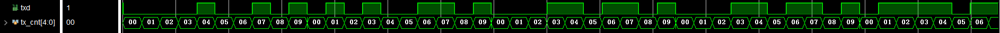
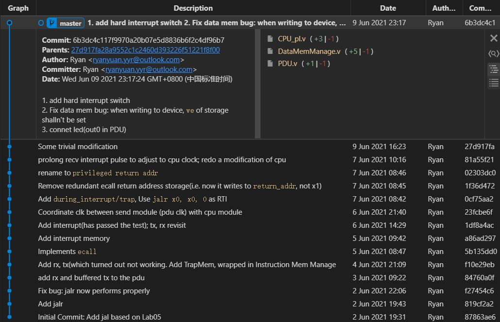

# Report on Lab06: CPU^+^

## Features

本次实验中，我为Lab05中的5-stage pipeline CPU加入了更多特性：

1. 增加指令`jalr`

2. 实现`ecall`及部分环境调用程序，包括：

   * 向数码管输出数字
   * 向UART输出字符
   * 向UART输出字符串
   * 从开关读入

3. 实现中断

   处理了对开关`valid`置位事件的响应

4. 连接外设UART(此特性仅通过了仿真检验)

   使用输出缓冲器解决CPU与IO不同步的问题

## Control Transfer

### `ecall`

1. `Trap Memory`

   地址`0x2000`至`0x2FFF`内保存了`ecall`相关的内容，包括

   1. Vector Table
   2. Ecall Programs

   其中Vector Table保存了各Ecall Program的起始地址。

   在我的实现中，Vector Table各条目含义如下：

   | Address  | `a0` | Meaning                                                      |
   | -------- | ---- | ------------------------------------------------------------ |
   | `0x2000` | 0    | Print integer stored in `a1` to `0x408`(Segment play)        |
   | `0x2004` | 1    | Print char stored in `a1` to UART                            |
   | `0x2008` | 2    | Print null-terminated string with initial address stored in `a1` to UART |
   | `0x200c` | 3    | Get value from `sw0~4` when `valid` is set.                  |

2. 跳转机制

   每次`ecall`的执行会带来两次跳转：a)从`ecall`所在位置跳转至Vector Table中对应条目；b)根据Vector Table Entry中的地址跳转至对应`Ecall Program`.  前者发生于`ecall`的`EXE`阶段，后者发生于`ecall`的`WB`阶段，其时序图如下：

   | Instruction            | clock0 | clock1 | clock2 | clock3    | clock4    | clock05   |
   | ---------------------- | ------ | ------ | ------ | --------- | --------- | --------- |
   | **`ecall`**            | IF     | ID     | EXE    | MEM       | WB        |           |
   | Followed Instruction   |        | IF     | ID     | *Flushed* | *Flushed* | *Flushed* |
   | Followed Instruction   |        |        | IF     | *Flushed* | *Flushed* | *Flushed* |
   | **Vector Table Entry** |        |        |        | **IF^1^** | ID        | *Flushed* |
   | Followed Entry         |        |        |        |           | IF        | *Flushed* |
   | **Ecall Program**      |        |        |        |           |           | **IF^2^** |

   其中两次跳转所在位置已用粗体凸显。

   在`IF`^1^处，$\text{PC}=0\text{x}2000+4\bullet\text{a0}$（其中`a0`应由用户在调用`ecall`前根据希望调用的功能赋值，如`a0 = 0`时的功能为将`a1`中值输出至数码管），此处跳转会将转至Vector Table中对应条目；

   在`IF`^2^处，$\text{PC}=\text{ID_IR}$(其中$\text{ID_IR}$为ID段寄存器中的指令寄存器)，此时的`IR`的值为Vector Table对应条目中的数值，也即Ecall Program的入口地址。

3. 从Ecall Program返回

   为确保Ecall Program执行结束后能正确返回至调用者，`ecall`会在`EXE`段将`PC(ecall) + 4`保存[^1]，并在整个环境调用结束后根据此返回地址返回。

   若将返回地址保存至某通用寄存器，ecall程序将无法恢复此寄存器的值（即将此寄存器设置为`ecall`调用之前的值），对Caller造成负担。因此，我们将返回地址保存至某专用寄存器`return_addr`，并借鉴`LC-3`汇编语言中的`RTI`(Return from Trap or Interrupt)指令，我们约定在ecall程序内部调用`jalr x0, x0, 0`实现的效果为跳转到`return_addr`。

4. The Complete Picture

   `ecall`调用的完整流程：

   1. `IF`

   2. `ID`

      将寄存器的`ra0`置为`a0`（用于`EXE`阶段跳转时计算Vector Table对应条目地址）

   3. `EXE`

      设置`next_pc`为`0x2000 + 4*a0`。置位`ID_Flush`和`EX_Flush`；将`PC+4`保存至`return_addr`；将`during_trap`寄存器置1；

   4. `MEM`

   5. `WB`

      设置`next_pc`为`ID_instruction_register`，置位`ID_Flush`。
      
   6. Ecall 程序运行，并通过`jalr x0, x0, 0`返回。

[^1]: 这里选择EXE段而非更早的阶段，是因为EXE段是Branch指令的跳转阶段，只有当`ecall`到达EXE段才能确保`ecall`会完整执行。

### Interrupt

当外设发出中断信号后，PC将跳转至中断服务程序(Interrupt Service Routine)。ISR根据中断原因（存储至专用寄存器`SCAUSE`）跳转到相应程序。程序运行结束后，PC跳转至中断前未执行结束的指令。

1. 专用寄存器

   为实现中断，这里设置的若干专用寄存器（相较于GPR而言）。每个专用寄存器与某内存地址成对应关系，程序为读、写专用寄存器，只需使用`lw`, `sw`指令对指定地址操作。

   各专用寄存器名称、作用、ISR所具有的权限及映射地址如下：

   | Name          | Purpose                              | Permission | Mapped Address |
   | ------------- | ------------------------------------ | ---------- | -------------- |
   | `InterruptOn` | 是否开启中断                         | Write      | `0x420`        |
   | `return_addr` | 保存从中断返回后需要执行的指令的地址 | Read       | `0x424`        |
   | `SCAUSE`      | 保存中断原因                         | Read       | `0x428`        |
   
2. ISR

   地址`0x1000`至`0x1FFF`保存了ISR及对具体中断进行处理的程序。
   
   ISR负责保存、恢复自身使用的寄存器。
   
3. 跳转机制

   若interrupt信号被置位，PC将被赋值`0x1000`，且**EXE段、ID段及IF段中第一个非空指令的PC**被存储至`return_addr`，ID段段寄存器、IF段段寄存器及EXE段段寄存器的Flush信号将被置位。

   跳转机制的设计基于以下事实：

   * IF, ID, EXE阶段，指令未进行写操作，故指令可多次、重复执行这些阶段而不产生其他影响。
   * 所有跳转指令均在EXE阶段（及之前）跳转，MEM,WB阶段指令不会改变PC。

   中断发生的完整流程如下，其中*clock0*时刻发生了中断。

   | Instruction | *Clock0* | Clock1    | Clock2    | Clock3    | Clock4    | Clock5 | Clock6 | …    | Clock(n) | Clock(n+1) |
   | ----------- | -------- | --------- | --------- | --------- | --------- | ------ | ------ | ---- | -------- | ---------- |
   | ins0        | MEM      | WB        |           |           |           |        |        |      |          |            |
   | ins1        | EXE      | *Flushed* | *Flushed* |           |           |        |        |      |          |            |
   | ins2        | ID       | *Flushed* | *Flushed* | *Flushed* |           |        |        |      |          |            |
   | ins3        | IF       | *Flushed* | *Flushed* | *Flushed* | *Flushed* |        |        |      |          |            |
   | ISR0        |          | IF        | ID        | EXE       | MEM       | WB     |        |      |          |            |
   | ISR1        |          |           | IF        | ID        | EXE       | MEM    | WB     |      |          |            |
   | …(ISR)      |          |           |           | …         |           |        |        |      |          |            |
   | RTI         |          |           |           |           | IF        | ID     | EXE    | MEM  | WB       |            |
   | ins1        |          |           |           |           |           | IF     | ID     | EXE  | MEM      | WB         |

   可以看到，*clock1*时刻发生了跳转，进入ISR.  当ISR执行结束后，PC跳转到ins1，即中断前在EXE段被Flush的指令。

4. 从中断返回

   出于与`ecall`相同的考虑，返回地址应存储于某专用寄存器（这里使用与`ecall`中相同的`return_addr`寄存器）而非通用寄存器，返回时使用`jalr x0, x0, 0`充当`RTI`的作用。

5. The Complete Picture

   下面逐周期地展示一次中断调用的流程

   1. 用户程序运行时，中断信号被置位，`next_pc`被ISR起始地址覆盖，ID, EXE, MEM段寄存器Flush信号被置位，EXE段（或ID/IF，如果EXE段为空指令）的PC被存入`return_addr`。
   2. `PC`被赋值为ISR起始地址，ID，EXE，MEM段为空指令, `during_interrupt`寄存器被置为1.
   3. ISR运行…
   4. `jalr x0, x0, 0`返回

## External Devices

1. 继承了Lab05中的所有外设设备，包括开关，LEDs，数码管

2. UART串口输入输出（此特性仅通过了仿真测试）

   为解决CPU与串口输出速度不一致的问题，本实现中设置输出缓冲区（队列），当CPU发出向串口写指令时，数据首先被写入队列。而队列非空时，发送模块将持续向tx端发送数据，直至队列为空。

   因此，当数据发送过程中，CPU可以处理后续指令，且在缓冲区大小足够的前提下，输出数据不会重复发送也不会被遗漏。

   

## Trivial Details

具体实现中的一些细节不便按照上文中分类展示，在这里简单介绍。

* `RTI`

  这里自作主张地约定`jalr x0, x0, 0`在`ecall`和中断中会起到根据`return_addr`返回的作用。

  执行流程：

  1. ID

     将EXE段段寄存器中信号`EXE_RTI`将置位，`EXE_RegReadData1`（与寄存器堆读口1相连的段寄存器）被置为`return_addr`，`EXE_imm`被置为0. 

  2. EXE

     根据信号`EXE_RTI`，寄存器`during_trap`和`during_interrupt`均会被复位。且同普通的`jalr`的设计，下个周期PC将被置为`EXE_RegReadData1`与`EXE_imm`的和，这里即为`return_addr`的值。

  这里有2点考虑值得注意：

  * `jalr 0x, 0x, 0`中源寄存器为`x0`。跟据Forwarding Unit的设计，这里将不发生转发，故ALU第一个操作数必然为`EXE_RegReadData1`的值。

  * 在EXE段方才将`during_trap`和`during_interrupt`复位，是因为只有到EXE段才能确定本指令会被完整执行（除中断出现外）。

    若在EXE之前复位，考虑如下指令：

    ```riscv
    beq x1, x0, loop
    jalr x0, x0, 0
    ```

    PC将跳转至loop所指位置（很可能时ISR内部指令）而非返回地址，但`during_trap`和`during_interrupt`已被错误地复位。

    或是，当`jalr x0, x0, 0`处EXE段，`during_trap`和`during_interrupt`已被复位，而interrupt信号也恰好置位，则下一周期将发生中断，`return_addr`被覆盖，PC将永远无法返回至用户程序。

* 中断服务程序中的现场恢复

  ISR返回前需要将保存的寄存器的值恢复，将中断打开。但值得注意的是，开启中断的方式是向地址（映射地址`0x420`）写入1（i.e.`sw xn, 0x420(zero)`），而写入1操作需要使用一个值为1的寄存器。因此，`xn`只能在`sw xn, 0x420(zero)`之后恢复。

  下面可以说明，按照如下方式可以保证恢复现场期间不会被另一中断打断。

  ```
  sw xn, 0x420(zero)
  lw xn, storage_addr
  ```

  根据`sw`的实现，WB段`interruptOn`方才被置位，即新的中断最早在Clock5跳转，此时`lw`指令执行到WB段，由中断的实现细节（即IF ID EXE段段寄存器被清空）知，`lw`可正常执行结束。

  | Instruction           | Clock0 | Clock1 | Clock2 | Clock3 | Clock4  | Clock5 |
  | --------------------- | ------ | ------ | ------ | ------ | ------- | ------ |
  | `sw xn, 0x420(zero)`  | IF     | ID     | EXE    | MEM    | **WB**  |        |
  | `lw xn, storage_addr` |        | IF     | ID     | EXE    | **MEM** | WB     |

  因此，只要在开启中断前恢复所有其他寄存器，而在开中断后立即恢复`xn`，即可保证现场被正确恢复。

## Test

两个测试程序分辨用于展示`ecall`和中断。

程序1使用`ecall`将fibonacci程序改写；程序2中用户程序使LED灯闪烁，程序响应`valid`开关的中断信号，ISR将`sw0~4`的数据输出至数码管。

## Conclusion

本次实验过程中充满了挑战与惊喜，串口调试过程穷尽了我debug的脑洞，最后选择放弃时十分后悔，后悔没早点放弃。

实现`ecall`和interrupt的过程对理解流水线有很大帮助。例如，`ecall`跳转的时机，中断时选择保存的PC，设置flag的阶段，都需要精心选择（因为拍脑袋决定时就会充满bugs）。因学疏才浅，很多机制的具体实现并未接触过，均根据自己的理解设计，最终能上板运行，也是一件让人十分兴奋的事（如果不是de了那么久bug的话）。

*（下图为本项目的commit记录）*


